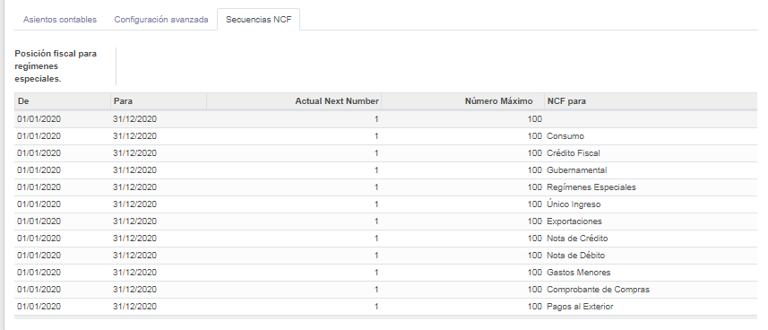

Localizacion Dominicana
=======================

Este repositorio consolida los módulos utilizados para poder realizar facturación en República Dominicana desde los módulos de Ventas, Compra, Contable y Punto de Ventas.

En esta versión están disponibles los siguientes módulos:

- **ncf_manager**: Este módulo agrega funcionalidades para manejar numero de comprobante fiscal NCF.

        - Secuencias Preconfiguradas para manejo de todos los NCF.
        - Validación en tiempo real de comprobantes.
        - Consulta de tasas de banco en tiempo real.
        - Creación de contactos por RNC o Cédula.

- **ncf_pos**: Incorpora funcionalidades de facturación con NCF al punto de venta.
      
        - WIP: compatibilidad con impresoras fiscales
  
- **ncf_sale**: Este módulo extiende la funcionalidad del ``ncf_manager`` hacia ventas, para realizar algunas validaciones antes de crear la factura.

- **ncf_purchase**: Este módulo extiende la funcionalidad del ``ncf_manager`` hacia compras, Se agrego un nuevo campo *Diario de Compras* en proveedores si este campo está configurado, las facturas generadas para estos proveedores toman este diario de manera predeterminada.

- **dgii_report**: Este módulo extiende las funcionalidades del ``ncf_manager`` integrando los reportes de declaraciones fiscales.
          
- **ncf_invoice_template**: Este modulo sobre escribe el formato de las facturas para adaptarlo a la Norma General 06-2018 de la DGII.
            
- **external_service_addons**:

         - ``l10n_do_currency_update``: Actualiza las tasas de moneda secundaria de la compañía de los bancos dominicanos
         - ``l10n_do_rnc_validation`` : Validar RNC / Cédula del servicio externo

         
Configuracion
=============

Instalar los modulos de la localizacion
---------------------------------------

Para esto, ir  **Aplicaciones** y busca **ncf**. Luego haga clic en **Instalar** el modulo ``ncf_manager`` despues los demas modulos que lo complementan.  ``ncf_invoice_template`` > ``ncf_sale`` > ``ncf_purchase`` y por ultimo ``ncf_pos`` instale este si requiere
utilizar el punto de venta.

.. image:: media/dominicana01.png
   :align: center

Configurar Compañía
~~~~~~~~~~~~~~~~~~~

Una vez que los módulos están instalados, el primer paso es configurar los datos de su empresa. Además de
información básica, un campo clave es **(RNC/NIF)**:

.. image:: media/dominicana02.png
   :align: center
   

Catalogo de Cuentas
~~~~~~~~~~~~~~~~~~~
Catálogo de Cuentas e Impuestos para República Dominicana, Compatible para Internacionalización con NIIF y alineado a las normas y regulaciones de la Dirección General de Impuestos Internos (DGII).

      - Catálogo de Cuentas Estándar (alineado a DGII y NIIF)
      - Catálogo de Impuestos con la mayoría de Impuestos Preconfigurados
            - ITBIS para compras y ventas
            - Retenciones de ITBIS
            - Retenciones de ISR
            - Grupos de Impuestos y Retenciones:
                  - Telecomunicaiones
                  - Proveedores de Materiales de Construcción
                  - Personas Físicas Proveedoras de Servicios
            - Otros impuestos

En la configuración de Contabilidad desplace a la seccion **Localizacion Fiscal** vera un paquete prefoconfigurado del catalogo de cuentas dominicano que se le instalara de manera automatica, que están relacionados con el tipo de responsabilidad fiscal de la compañía.

Comprobantes Fiscales
~~~~~~~~~~~~~~~~~~~~~
En la configuracion de contabilidad selecione la opcion **Diario**, crear o editar el diario de ventas, escoja el Tipo de Diario > Ventas  luego active el **Control de NCF** luego haga click Generar NCF.

.. image:: media/dominicana09.PNG
   :align: center

Secuencias generadas de forma automatica.

Declaraciones Fiscales
~~~~~~~~~~~~~~~~~~~~~~

Tasas de Banco Dominicanos
==========================

Para esto, ir  **Aplicaciones** y buscar **Dominican Banks Currency Update**. Luego haga clic en *Instalar*.

.. image:: media/dominicana04.png
   :align: center

Configuraciones 
---------------

En la configuracion de contabilidad desplace hasta la seccion **Multi-Divisas** active la función de monedas múltiples luego Configure los parámetros de tasas de su banco dominicano como banco, intervalo, base y compensación.

Configuraciones técnicas
------------------------

Debe configurar su clave API para autenticarse con el servicio externo.
* Vaya a Configuración> Técnico> Parámetros> Parámetros del sistema
* Establezca su clave en el valor de registro de parámetro `indexa.api.token`

.. image:: media/dominicana06.png
   :align: center

Puede configurar el momento en que se ejecutará su acción de actualización de moneda

* Vaya a Configuración> Automatización> Acciones programadas

* Haga clic en ** [MONEDA] Actualizar l10n_do bancos moneda ** cron
* Establezca su hora en la próxima fecha de ejecución

.. image:: media/dominicana08.png
   :align: center

Notas
-----
No cambie ningún otro campo **Acciones programadas**. Su cron debe ejecutarse diariamente, incluso si sus parámetros **Tasas de Banco Dominicano** no lo hacen.

Uso
---
Sus **Acciones programadas** recuperarán sus tasas bancarias de la API dada en los intervalos que configure en su configuración.
